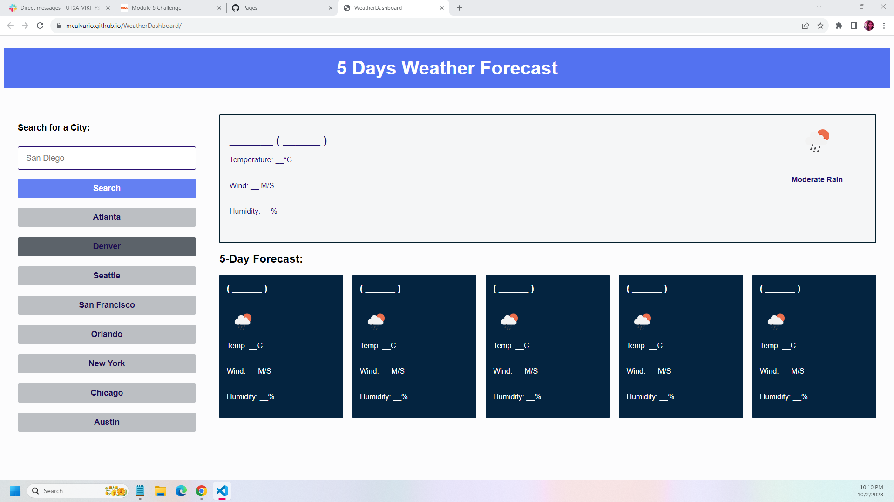

# WeatherDashboard

## Description
As a full stack web developer, I want to build a weather dashboard for travelers to see the weather outlook for multiple cities so that they can plan a trip accordingly.

# Usage
To use this weather dashboard application with form inputs, first, search for a city.  You will be presented with current and future conditions for that city.  That city will then be added to the search history.  When you view the current weather conditions for that city, you will be presented with the city name, date, and an icon representation of weather conditions, the temperature, the humidity, and the the wind speed.  When you view future weather conditions for that city, you will be presented with a 5-day forecast that displays the date, an icon representation of weather conditions, the temperature, the wind speed, and the humidity.  Click on a city in the search history to be presented with current and future conditions for that city.

# Live Site Application
[Link to Live Site] https://mcalvario.github.io/WeatherDashboard/
[Screenshot of application] 
[Link to updated portfolio] https://mcalvario.github.io/Professional-Portfolio/

# Credits
Openweathermap.org:  https://openweathermap.org/weather-conditions
Geeksforgeeks:  https://www.geeksforgeeks.org/weather-app-using-vanilla-javascript/
Youtube:  https://www.youtube.com/watch?v=w0VEOghdMpQ

# License
Copyright (c) [2023] [Weather-Dashboard]

Permission is hereby granted, free of charge, to any person obtaining a copy
of this software and associated documentation files (the "Software"), to deal
in the Software without restriction, including without limitation the rights
to use, copy, modify, merge, publish, distribute, sublicense, and/or sell
copies of the Software, and to permit persons to whom the Software is
furnished to do so, subject to the following conditions:

The above copyright notice and this permission notice shall be included in all
copies or substantial portions of the Software.

THE SOFTWARE IS PROVIDED "AS IS", WITHOUT WARRANTY OF ANY KIND, EXPRESS OR
IMPLIED, INCLUDING BUT NOT LIMITED TO THE WARRANTIES OF MERCHANTABILITY,
FITNESS FOR A PARTICULAR PURPOSE AND NONINFRINGEMENT. IN NO EVENT SHALL THE
AUTHORS OR COPYRIGHT HOLDERS BE LIABLE FOR ANY CLAIM, DAMAGES OR OTHER
LIABILITY, WHETHER IN AN ACTION OF CONTRACT, TORT OR OTHERWISE, ARISING FROM,
OUT OF OR IN CONNECTION WITH THE SOFTWARE OR THE USE OR OTHER DEALINGS IN THE
SOFTWARE.

